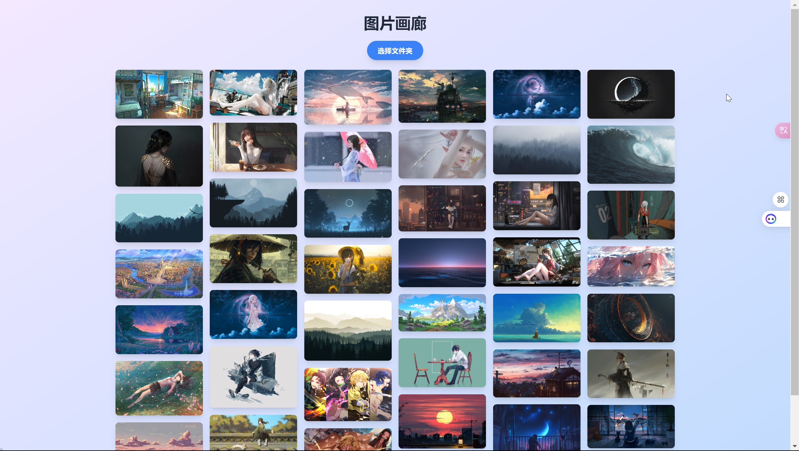

# 本地图片画廊 (Local Image Gallery)

这是一个简洁而高效的本地图片查看应用，专为浏览和管理您设备上的图片而设计。它提供了一个直观的界面，让您可以轻松地浏览、查看和组织您的本地图片集。



## 功能特点

- 瀑布流布局，优雅展示不同尺寸的图片
- 响应式设计，完美适配桌面和移动设备
- 图片懒加载，提升大量图片时的浏览性能
- 点击图片查看大图，支持图片详情展示
- 支持多种图片格式，包括 JPEG、PNG、GIF 等
- 简洁直观的用户界面，操作便捷
- 支持按文件名排序和筛选图片
- 自动加载指定目录下的所有图片

## 技术栈

- React.js
- TypeScript
- Tailwind CSS
- react-masonry-css (用于瀑布流布局)
- react-intersection-observer (用于图片懒加载)

## 快速开始

1. 克隆仓库:
   ```
   git clone https://github.com/OrangeCatSleepless/image-gallery.git
   ```

2. 安装依赖:
   ```
   cd image-gallery
   npm install
   ```

3. 运行开发服务器:
   ```
   npm start
   ```

4. 在浏览器中打开 `http://localhost:3000` 查看应用

## 部署

本项目使用 Vercel 进行部署。要部署您自己的版本:

1. Fork 这个仓库
2. 在 Vercel 上创建一个新项目
3. 连接您的 GitHub 仓库
4. 点击 "Deploy"

## 贡献

欢迎提交 Pull Requests 来改进这个项目。对于重大更改，请先开 issue 讨论您想要改变的内容。

## 许可证

[MIT](https://choosealicense.com/licenses/mit/)

---

本项目的README由 [AI Artifacts by E2B](https://artifacts.e2b.dev/) 辅助生成。AI Artifacts 是一个强大的工具，可以帮助开发者快速创建高质量的文档和代码片段。
